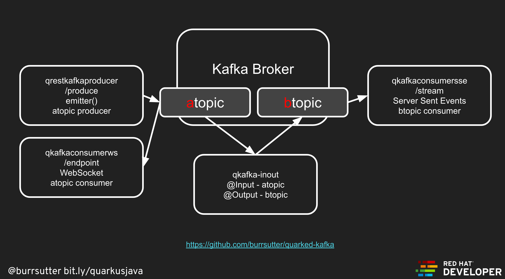

== Quarkus and Kafka via Reactive Messaging

Prereqs:

* Docker for Mac or Docker for Windows

* Maven

* Java

* brew install kafkacat

==== 1. Terminal 1
----
docker-compose up
----

This leverages the docker-compose.yaml file to start a "local" zookeeper + Apache Kafka broker on ports 2181 and 9092

==== 2. Terminal 2 - test produce
----
kafkacat -P -b localhost -t my-topic
kafkacat -P -b localhost -t atopic
kafkacat -P -b localhost -t btopic

# stop with
ctrl-z 
----

==== 3. Terminal 3 - test consume
----
kafkacat -C -b localhost -t my-topic
kafkacat -C -b localhost -t atopic
kafkacat -C -b localhost -t btopic

# stop with
ctrl-c
----

==== 4. Terminal 2 - REST producer to atopic
----
cd qrestkafkaproducer
mvn compile quarkus:dev
open http://localhost:8080/produce
----

==== 5. Terminal 3 - consumer of atopic, websocket to browser
----
cd qkafkaconsumerws
mvn compile quarkus:dev
open http://localhost:8081/index.html
----

==== 6. Terminal 4 - consumer of btopic, SSE to browser
----
cd qkafkaconsumersse
mvn compile quarkus:dev
open http://localhost:8082/stream
----

==== 7. Terminal 5 - atopic to btopic transformer/filter
----
cd qkafka-inout
mvn compile quarkus:dev
----

to cause reload of inout

----
curl http://localhost:8083/reset
----

==== 8. Terminal 6 - send in a message
----
curl http://localhost:8080/produce
----
